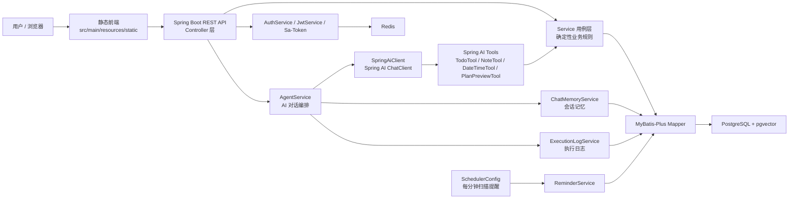
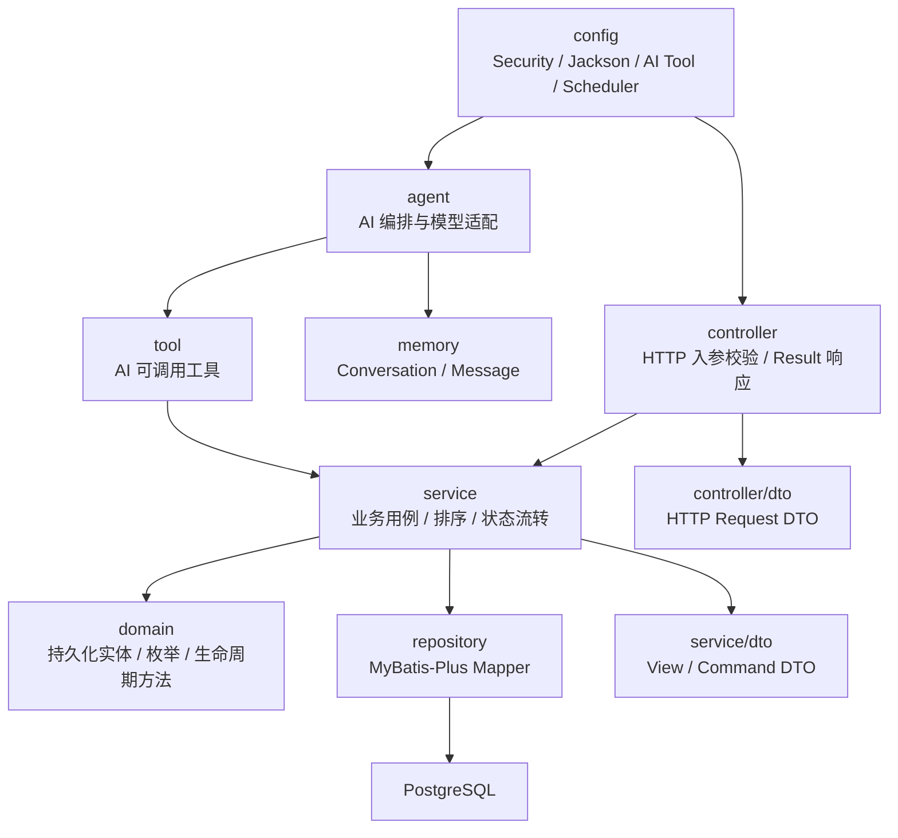
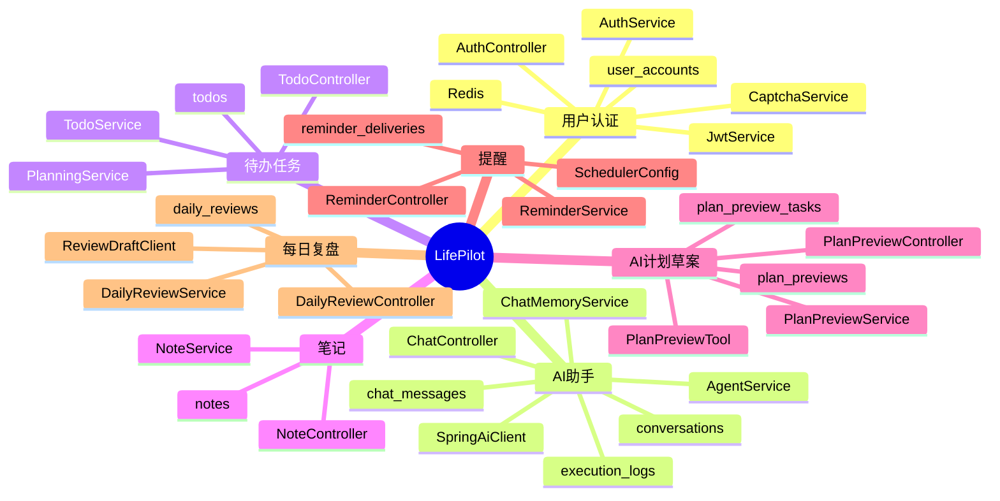
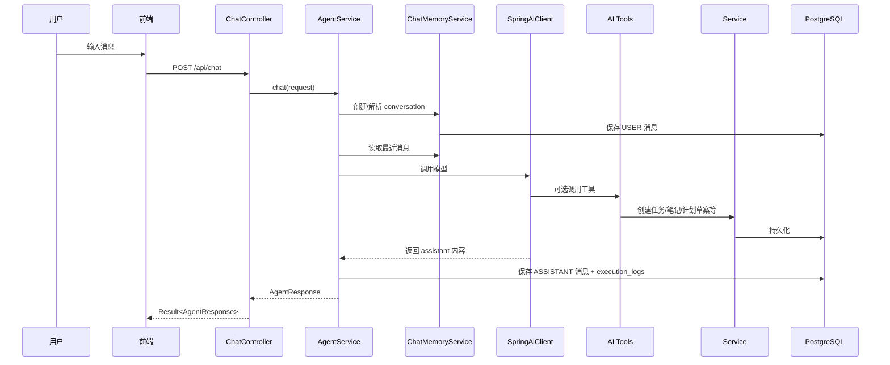
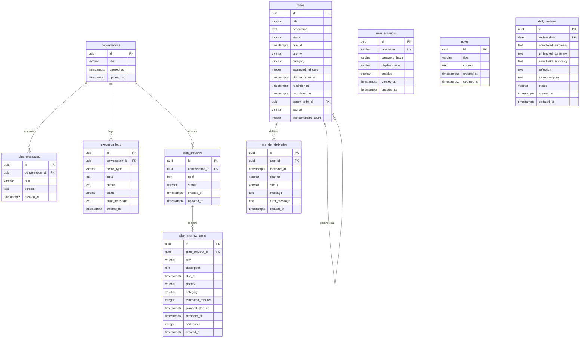

# LifePilot 当前架构与设计

## 1. 总体架构

LifePilot 当前是一个 Java 21 + Spring Boot 3.3 的模块化单体应用。前端为静态页面，后端提供 REST API、AI Agent 编排、业务用例、持久化、认证、提醒调度和观测能力。



## 2. 后端分层



### 分层职责

- `controller`: 负责 REST API、请求 DTO、参数校验和统一 `Result<T>` 响应。
- `service`: 负责业务用例、事务边界、确定性排序和状态流转。
- `domain`: 负责持久化实体、领域枚举和基础生命周期方法。
- `repository`: 负责 MyBatis-Plus Mapper 数据访问。
- `agent`: 负责 AI 对话编排、模型适配和结构化动作收集。
- `tool`: 负责 Spring AI 工具封装，工具内部调用 Service。
- `memory`: 负责对话、消息记忆读写。
- `config`: 负责安全、Jackson、AI 工具、定时任务等基础配置。

## 3. 核心业务模块



## 4. AI 对话流程



## 5. 数据模型



## 6. 关键设计决策

### 6.1 模块化单体优先

当前业务处于个人执行助手的早期阶段，领域边界还在演化。采用模块化单体可以保留清晰边界，同时避免微服务带来的部署、链路追踪、分布式事务和数据一致性成本。

### 6.2 AI 负责建议，Service 负责落地

AI 通过 Spring AI Tool 触发能力，但工具层不直接承载复杂业务规则，而是调用 Service。这样可以保证待办排序、计划确认、提醒投递、复盘生成等关键逻辑保持确定性和可测试。

### 6.3 高风险动作需要用户确认

AI 可以创建计划草案，但不能直接确认草案并批量创建待办。确认动作由用户通过前端或明确 API 发起，避免模型误操作造成数据污染。

### 6.4 DTO 与持久化实体分离

Controller 使用 `controller/dto` 接收请求，Service 使用 `service/dto` 返回视图和命令对象。持久化实体不直接暴露给 HTTP 层，减少 API 与数据库模型之间的耦合。

### 6.5 Flyway 管理数据库结构

所有 schema 变更通过 `src/main/resources/db/migration` 下的 Flyway 迁移文件演进。当前核心表包括用户、会话、消息、待办、笔记、执行日志、计划草案、提醒投递和每日复盘。

## 7. 运行与基础设施

本地开发依赖 Docker Compose 启动 PostgreSQL 和 Redis。

- PostgreSQL: `localhost:15432`
- Redis: `localhost:6380`
- Backend: `localhost:8081`
- 可选 Docker frontend: `localhost:3000`

主要运行命令：

```powershell
docker compose up -d postgres redis
.\gradlew.bat bootRun
.\gradlew.bat test
```

## 8. 当前风险与后续演进点

- 用户隔离尚需继续补齐：认证表已经存在，但 Todo、Note、Conversation 等核心业务表还需要按用户维度隔离。
- AI 工具输入可能包含个人内容，执行日志需要继续控制敏感信息记录范围。
- `pgvector` 已启用，但当前代码还没有完整 RAG/向量检索链路，可作为后续记忆增强方向。
- 前端目前仍有一套静态资源，同时 docker-compose 中存在独立 frontend 服务，后续需要统一前端部署形态。
- 每分钟扫描提醒适合当前规模，后续如果提醒量增加，可演进为队列或数据库延迟任务模型。
